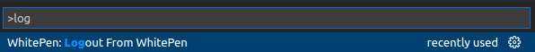

# Whitepen Scanner

This is the README for Whitepen Scanner. The main concept of this scanner is to detect vulnerabilites in the installed packages.

## Registration

<<<<<<< HEAD
First step is to make registartion by email on https://cgcnets.com:61040/graphql/ 

## Login

After installing WhitePen extension, you have to login by clicking on  Connect VS Code with WhitePen 

=======
First step is to make registartion by email on https://theateam.xyz

## Login

After installing WhitePen extension, you have to login by clicking on "Connect VS Code with WhitePen"
>>>>>>> 358144879a48336dfe98c4c6c519809bbfe0825e

## Run Package Checker

After Logging in, the package checker will run automatically or by clicking ctrl+shift+p and choosing command  WhitePen: Start WhitePen Dependencies Scanner

## Show Vulnerable Package

After running package checker, the vulnerable packages will appear on the left side.

## Show CVEs

After clicking on one of the vulnerable packages a new tab will appear under it showing the cves contained on the selected package with the colored icon based on the severity of each cve.

## Show CVE Information

You can view the information of each cve by clicking on it. A new tab will open on the right side showing its information.

## Logout

<<<<<<< HEAD
You can Logout from the extension by executing command ctrl+shift+p  WhitePen: Logout From WhitePen  
=======
You can Logout from the extension by executing command ctrl+shift+p  WhitePen: Logout From WhitePen

>>>>>>> 358144879a48336dfe98c4c6c519809bbfe0825e
